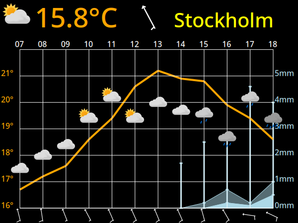

# inky-wx

Weather app for [RaspberryPi]() and [Pimoroni](https://shop.pimoroni.com/)
[Inky Impression 5.7"](https://shop.pimoroni.com/products/inky-impression-5-7)
7 colour e-paper display (it may work with other displays but this is not
tested). It uses weather forecast data from
[yr.no](https://api.met.no/weatherapi/locationforecast/2.0/documentation).

## Example display:


Current weather in Stockholm is 15.8°C, partially cloudy and light wind
from south by southeast.

By 13:00 the sky is expected to be overcast and the temperature just over
21°C. The afternoon will see rain, expected less than 1mm each hour, but
maybe nearly 5mm during the hour 17:00-18:00.

For an explaration of how to read wind barbs, see this blog post from
[windy.app](https://windy.app/blog/learn-to-read-wind-barbs.html)

## Status and how to run:
Very experimental. Requires a python environment with the Pimoroni Inky
[Python library](https://github.com/pimoroni/inky).
Depending on your raspberry pi version and OS version, you may have to search
forums  to find the right version/branch for you. Other required libraries are
`pytz`, `urllib3`, `cairosvg` and `pillow`

You also need to download [weather icons](https://github.com/metno/weathericons/)
and store them in the directory `weather/svg` relative to the working directory
of the program.

You must provide a configuration containing at least your position (lat/long),
name of the place, and a `"User-Agent"` as per the
[terms of service](https://developer.yr.no/doc/TermsOfService/) for the API
from [yr.no](https://yr.no). *Note* YR may deny the request if the user agent is
not set correctly.

Usage:
Create a configuration file named `config.json` in the directory of the python
files. It must contain:

```JSON-comment
{
  "user_agent": "",           //<string: see https://developer.yr.no/doc/TermsOfService/>
  "lat": 0.0,                 //<numerical latitude in degrees North in decimal form>
  "long": 0.0,                //<numerical longitude in degrees East in decimal form>,
  "placename": "Null Island"  //<string with the name of the place at the coordinate>
}
```

The configuration file may in addition contain (note that all colors are
optional, the values shown are the defaults):
```JSON
{
  "colors": {
    "background":    "white",
    "grid":          "black",
    "temperature":   "red",
    "precipitation": "blue",
    "wind":          "black",
    "placename":     "black",
    "hour":          "black"
  }
}
```

Sending a `SIGHUP` to the process causes a re-read of the configuration
